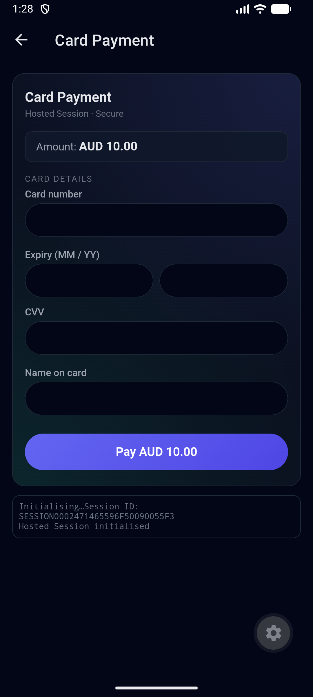
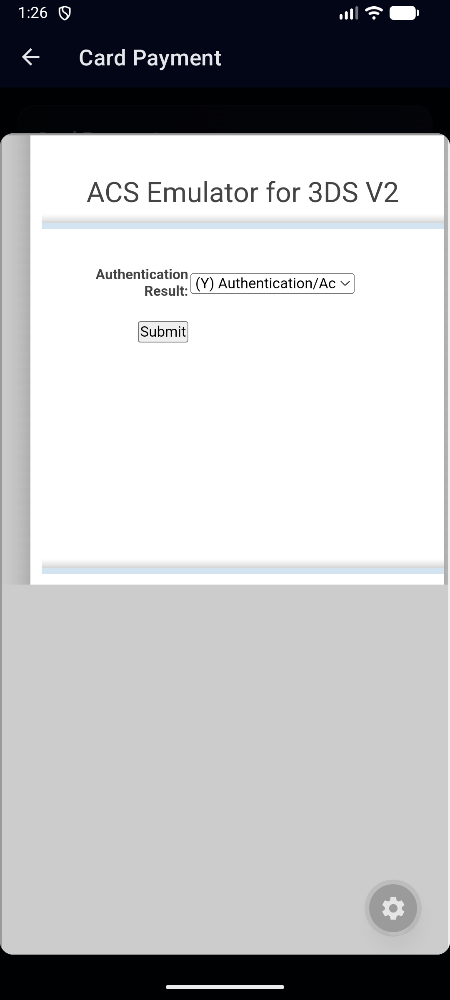
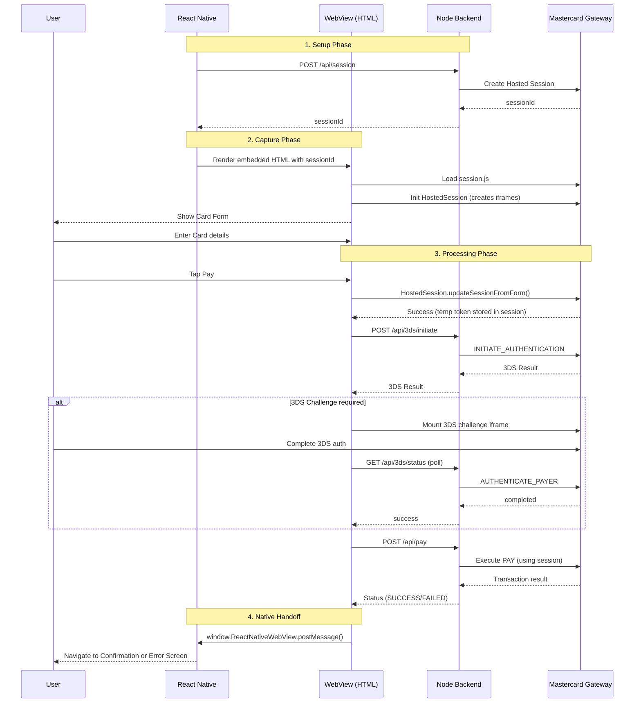
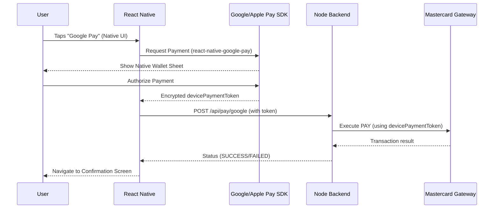

# MPGS React Native Hosted Checkout

<p align="center">
  
  &nbsp; &nbsp; &nbsp;
  
</p>

A React Native Expo app integrating Mastercard Payment Gateway Services (MPGS) Hosted Session checkout. Card payments (including 3DS authentication) run inside a WebView, with native screens for order entry, confirmation, and errors.

## Features

- **Card payments** — MPGS Hosted Session with hosted fields (card number, expiry, CVV, name)
- **3DS authentication** — Full 3DS2 flow (frictionless + challenge) inside the WebView
- **Google Pay** — Native hook ready for Android dev builds
- **Apple Pay** — Placeholder (requires Apple Developer setup)
- **PayPal** — Placeholder (requires backend endpoints)

## Prerequisites

- **Node.js** ≥ 18
- **npm** ≥ 9
- **Expo CLI** — installed globally or via `npx`
- **Xcode** (for iOS) or **Android Studio** (for Android)
- MPGS sandbox credentials (merchant ID + API password)

## Quick Start

### 1. Install dependencies

```bash
# React Native app
npm install

# Backend
cd backend && npm install
```

### 2. Configure the backend

```bash
cd backend
cp .env.example .env
# Edit .env with your MPGS sandbox credentials
```

### 3. Start the backend

```bash
cd backend
PORT=3001 npm start
```

The backend runs on `http://localhost:3001`.

### 4. Run the app

Since the app uses `react-native-webview` (a native module), it requires a **development build** — Expo Go won't work.

```bash
# iOS (requires Xcode)
npx expo run:ios

# Android (requires Android Studio)
npx expo run:android
```

Alternatively, to start the Metro bundler (if you already have a dev build installed):

```bash
npx expo start --dev-client
```

### 5. Test a payment

1. Enter an amount (default: $10.00)
2. Tap **Pay with Card**
3. Fill in the test card details (see [Test Cards](#test-cards))
4. Tap **Pay** — the 3DS flow will run
5. You should see the **Payment Successful** screen

## Test Cards

| Card | Number | Expiry | CVV | 3DS Behaviour |
|------|--------|--------|-----|---------------|
| Mastercard (No 3DS / Frictionless) | `5123456789012346` | Any future date | `100` | 3DS passes silently |
| Mastercard (3DS Challenge) | `5123450000000008` | Any future date | Any 3 digits | Triggers 3DS challenge |

## Project Structure

```
├── app/                       # React Native (Expo Router)
│   ├── _layout.tsx            # Root Stack navigator
│   ├── index.tsx              # Order screen
│   └── payment/
│       ├── _layout.tsx        # Payment sub-stack (modal)
│       ├── checkout.tsx       # WebView checkout
│       ├── confirmation.tsx   # Success screen
│       └── error.tsx          # Error screen
├── src/
│   ├── api/                   # Backend API client
│   ├── checkout/              # WebView HTML generator + messages
│   ├── components/            # Reusable UI components
│   ├── constants/             # Config + feature flags
│   └── payments/              # Payment hooks (Google/Apple/PayPal)
├── backend/                   # Node.js Express backend
│   ├── src/
│   │   ├── server.ts          # API routes
│   │   ├── mpgs.ts            # MPGS gateway integration
│   │   └── db.ts              # SQLite order storage
│   ├── .env.example           # Environment template
│   └── package.json
└── web-reference/             # Reference web frontend (browser-based)
    ├── index.html             # Hosted Session web UI
    ├── checkout.js            # Card + 3DS + PAY flow
    └── wallets.js             # Google Pay / Apple Pay (web)
```

## Architecture

The app uses a **WebView-centric** approach for card payments:



This minimises the bridge complexity — the WebView handles the entire card capture and 3DS payment flow securely, and only posts the final result back to the native app context.

## Wallets & Alternative Payments (Apple Pay, Google Pay)

While the MPGS Hosted Session handles standard card capture beautifully inside a WebView, digital wallets (Apple Pay, Google Pay) require a robust Native-first approach in React Native. 

**Architectural Best Practice:** Wallet buttons must be rendered in the **Native UI**, not the HTML WebView. Apple strictly enforces Native button styling and behaviors for Apple Pay, and Google Pay requires native SDK invocation.

The repository includes a Native UI component for this exact purpose: `src/components/PaymentMethodSelector.tsx`.

### Native Wallet Flow

Instead of capturing a card through an iframe, the Native App asks the OS for an Encrypted Payment Token and forwards it to your backend to process the MPGS `PAY` operation.



### Implementation Hooks (Included Placeholder Code)

The repository provides extensive, well-documented placeholder hooks that are ready to be integrated into your production build:

- **Google Pay** (`src/payments/useGooglePay.ts`): Fully implemented via `react-native-google-pay`. Grabs the `devicePaymentToken` and posts to the backend. Requires a physical/emulated Android device (no Expo Go).
- **Apple Pay** (`src/payments/useApplePay.ts`): A heavily documented placeholder. Explains the strict Apple Developer Certificate requirements needed before Apple Pay can be initialized on iOS.
- **PayPal** (`src/payments/usePayPal.ts`): A placeholder explaining the MPGS Browser Payment interaction model, which requires an out-of-app Browser redirect and a webhook/backend-return handler to correctly capture the payment.

## Running on a Physical Device

When running on a physical device, `localhost` won't work. Update `src/constants/config.ts` to point to your machine's LAN IP:

```ts
export const API_BASE_URL = 'http://192.168.x.x:3001';
```

## Backend API

| Method | Path | Purpose |
|--------|------|---------|
| GET | `/api/config` | Returns `baseUrl`, `merchantId`, `formVersion`, `enable3ds` |
| POST | `/api/session` | Creates a new MPGS Hosted Session |
| POST | `/api/3ds/initiate` | `INITIATE_AUTHENTICATION` |
| POST | `/api/3ds/authenticate` | `AUTHENTICATE_PAYER` |
| GET | `/api/3ds/status` | Polls 3DS transaction status |
| POST | `/api/tokenize` | Creates a card token from a session |
| POST | `/api/pay` | `PAY` — session, token, or device payment token |
| POST | `/api/pay/google` | Google Pay `PAY` shortcut |

## Environment Variables

| Variable | Description |
|----------|-------------|
| `MPGS_BASE_URL` | MPGS gateway URL (sandbox: `https://test-tyro.mtf.gateway.mastercard.com`) |
| `MPGS_MERCHANT_ID` | Your MPGS merchant ID |
| `MPGS_API_PASSWORD` | Your MPGS API password |
| `MPGS_API_VERSION` | MPGS API version (e.g. `100`) |
| `MPGS_FORM_VERSION` | Hosted Session form version |
| `ENABLE_3DS` | Enable 3DS authentication (`true`/`false`) |

## MPGS Documentation

- [Hosted Session Integration Guide](https://tyro.gateway.mastercard.com/api/documentation/integrationGuidelines/hostedSession/integrationModelHostedSession.html?locale=en_US)
- [API Reference](https://tyro.gateway.mastercard.com/api/documentation/apiDocumentation/rest-json/version/latest/apiReference.html?locale=en_US)
- [Test & Go Live](https://tyro.gateway.mastercard.com/api/documentation/integrationGuidelines/supportedFeatures/testAndGoLive.html?locale=en_US)

## Web Reference Frontend

The `web-reference/` folder contains the original browser-based checkout UI. Run it via the backend:

```bash
cd backend && PORT=3001 npm start
# Open http://localhost:3001 in a browser
```

This is useful for comparing behaviour against the React Native implementation.

## License

This project is licensed under the MIT License.

*Note: Mastercard Payment Gateway Services (MPGS) and associated trademarks are copyright of Mastercard.*
