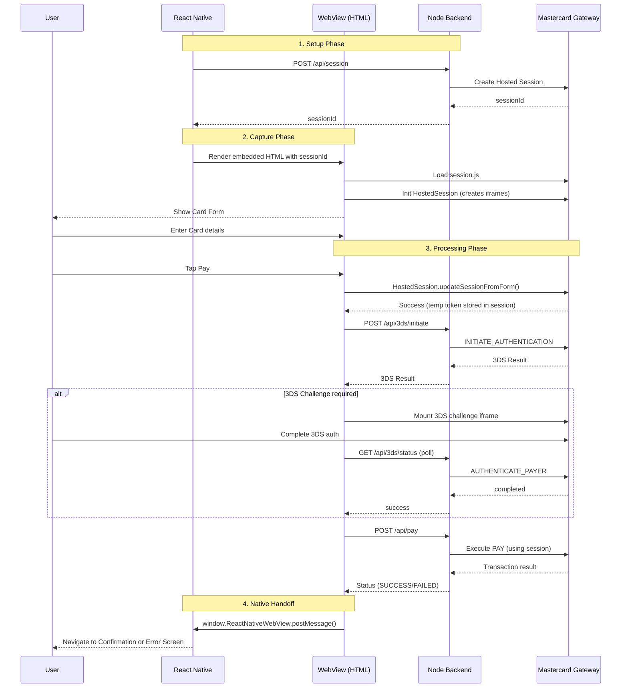
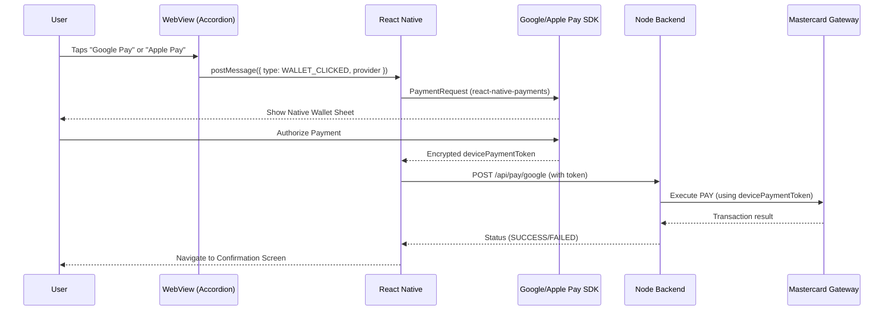

# MPGS React Native Hosted Checkout — Claude Code Skill

You are an expert in Mastercard Payment Gateway Services (MPGS) integration within a React Native Expo app. This project is a working demo of MPGS Hosted Session checkout with card payments, 3DS authentication, and wallet payment stubs — all running inside a WebView with native handoff.

## Project Overview

This is a **React Native Expo** app (Expo Router, SDK 55) that integrates MPGS Hosted Session for card payments. The architecture uses a **WebView-centric** approach: the entire card capture, tokenisation, 3DS authentication, and PAY flow runs inside an embedded HTML page, and only the final result is posted back to the native app via `postMessage`.

### Key Architecture Decisions

- **WebView for card capture**: Card fields are MPGS Hosted Session iframes rendered in a WebView (`src/checkout/checkoutHtml.ts`). This avoids PCI scope on the native side.
- **Native-first for wallets**: Apple Pay / Google Pay buttons are rendered in the WebView accordion but trigger native payment via `postMessage`. The `WALLET_CLICKED` message is sent to the native layer, which invokes the OS payment sheet via `@rnw-community/react-native-payments`. Wallet buttons are automatically hidden in Expo Go (detected via `expo-constants` `ExecutionEnvironment.StoreClient`).
- **Backend proxy**: A Node.js Express backend (`backend/`) proxies all MPGS API calls (session creation, 3DS, PAY) so the API password never touches the client.
- **Expo dev build required**: `react-native-webview` is a native module, so Expo Go won't work — use `npx expo run:ios` or `npx expo run:android`.

## Tech Stack

- **Frontend**: React Native 0.83, Expo SDK 55, Expo Router, TypeScript
- **WebView**: `react-native-webview` 13.x — renders self-contained HTML with MPGS session.js
- **Wallets**: `@rnw-community/react-native-payments` 1.x — W3C Payment Request API for Apple Pay / Google Pay
- **Backend**: Node.js, Express 5, TypeScript, axios, SQLite (order storage), dotenv
- **Payment Gateway**: MPGS REST API v100, Hosted Session, 3DS2

## Project Structure

```
app/                          # Expo Router screens
  _layout.tsx                 # Root Stack navigator
  index.tsx                   # Order screen (amount input + continue to checkout)
  payment/
    _layout.tsx               # Payment sub-stack (modal presentation)
    checkout.tsx              # WebView checkout (card + 3DS + wallets)
    confirmation.tsx          # Success screen
    error.tsx                 # Error screen

src/
  api/
    client.ts                 # Fetch wrapper for backend API
    mpgs.ts                   # getConfig(), createSession() helpers
    types.ts                  # API response types
  checkout/
    checkoutHtml.ts           # Generates the full HTML/JS for the WebView checkout
    messages.ts               # WebView <-> Native message types + parser
  components/
    PaymentMethodSelector.tsx # Native payment method buttons (Card, GPay, Apple Pay, PayPal)
    LoadingOverlay.tsx        # Full-screen loading spinner
  constants/
    config.ts                 # API_BASE_URL, feature flags
  payments/
    useGooglePay.ts           # Google Pay hook (@rnw-community/react-native-payments)
    useApplePay.ts            # Apple Pay hook (@rnw-community/react-native-payments)
    usePayPal.ts              # PayPal placeholder (documented)

backend/
  src/
    server.ts                 # Express routes: /api/config, /api/session, /api/3ds/*, /api/pay
    mpgs.ts                   # MPGS REST API client (session, 3DS, tokenise, pay)
    db.ts                     # SQLite order storage
  .env.example                # Environment template (MPGS credentials)

web-reference/                # Browser-based reference frontend for comparison
```

## Payment Flow

1. **Order screen** (`app/index.tsx`): User enters amount, taps "Continue to Checkout"
2. **Session creation**: App calls `POST /api/session` -> backend creates MPGS Hosted Session
3. **Checkout WebView** (`app/payment/checkout.tsx`): Renders HTML from `checkoutHtml.ts` with session ID
4. **Card capture**: MPGS `session.js` creates secure hosted field iframes inside the WebView
5. **3DS flow** (if enabled): INITIATE_AUTHENTICATION -> AUTHENTICATE_PAYER -> challenge if needed (polling)
6. **PAY**: Backend calls MPGS PAY with the session token
7. **Result handoff**: WebView posts result via `postMessage` -> native navigates to confirmation/error

### Card Payment Sequence (with 3DS)



### Wallet Payment Sequence (Google Pay / Apple Pay)

Wallet buttons live in the WebView accordion. When tapped, a `WALLET_CLICKED` message bridges to native, which invokes the OS payment sheet.



## WebView <-> Native Message Protocol

Messages are JSON strings sent via `window.ReactNativeWebView.postMessage()`:

| Type | Direction | Purpose |
|------|-----------|---------|
| `PAYMENT_RESULT` | WebView -> Native | Payment completed (SUCCESS or FAILED) |
| `ERROR` | WebView -> Native | Unrecoverable error |
| `LOG` | WebView -> Native | Debug log forwarding |
| `WALLET_CLICKED` | WebView -> Native | User tapped wallet button, includes `provider` field |

## Backend API Routes

| Method | Path | Purpose |
|--------|------|---------|
| GET | `/api/config` | Returns MPGS config (baseUrl, merchantId, formVersion, enable3ds) |
| POST | `/api/session` | Creates a new MPGS Hosted Session |
| POST | `/api/3ds/initiate` | INITIATE_AUTHENTICATION |
| POST | `/api/3ds/authenticate` | AUTHENTICATE_PAYER |
| GET | `/api/3ds/status` | Polls 3DS transaction status |
| POST | `/api/tokenize` | Creates a card token from a session |
| POST | `/api/pay` | PAY — accepts session, token, or device payment token |
| POST | `/api/pay/google` | Wallet PAY shortcut (used by both Google Pay and Apple Pay) |

## Environment Variables (backend/.env)

```
MPGS_BASE_URL=https://test-tyro.mtf.gateway.mastercard.com
MPGS_MERCHANT_ID=<your merchant ID>
MPGS_API_PASSWORD=<your API password>
MPGS_API_VERSION=100
MPGS_FORM_VERSION=100
ENABLE_3DS=true
```

## Common Tasks

### Adding a new payment method
1. Create a hook in `src/payments/` (follow `useGooglePay.ts` pattern)
2. Add the method to `PaymentMethodSelector.tsx`
3. Handle the `WALLET_CLICKED` message in `app/payment/checkout.tsx`
4. Add backend route in `backend/src/server.ts` if needed
5. Add MPGS API call in `backend/src/mpgs.ts` if needed

### Modifying the checkout UI
- All checkout HTML/CSS/JS is in `src/checkout/checkoutHtml.ts` as a template literal
- The form uses MPGS Hosted Session iframes (fields are `readonly` — MPGS replaces them)
- Accordion sections: Credit Card, Digital Wallets (conditionally hidden in Expo Go via `isExpoGo`), PayPal

### Adding a new backend endpoint
- Add route in `backend/src/server.ts`
- Add MPGS API call in `backend/src/mpgs.ts` (follow existing patterns with `authConfig()`)
- All MPGS calls use Basic Auth: `merchant.<MERCHANT_ID>` / `<API_PASSWORD>`

### Changing the 3DS flow
- 3DS logic lives in the WebView JS (`checkoutHtml.ts`, `run3DSFlow` function)
- Backend handles INITIATE and AUTHENTICATE via `mpgs.ts`
- Challenge polling: WebView polls `GET /api/3ds/status` every 2s, up to 30 attempts

## Important Gotchas

- **MPGS Hosted Session fields are iframes**: The `<input>` elements in the checkout HTML are replaced by MPGS with secure iframes. They are `readonly` in the source — never try to read card data from them directly.
- **3DS challenge is an HTML blob**: MPGS returns raw HTML for the challenge redirect form. The WebView injects it and auto-submits.
- **Android emulator localhost**: Android emulator uses `10.0.2.2` to reach the host machine's `localhost`. This is handled in `src/constants/config.ts`.
- **Physical device**: Must update `API_BASE_URL` in `config.ts` to the machine's LAN IP.
- **Expo Go detection**: Wallet buttons (Apple Pay, Google Pay) are automatically hidden in Expo Go via `expo-constants` (`ExecutionEnvironment.StoreClient`). Card payments still work in Expo Go. Full wallet support requires a dev build (`npx expo run:ios` / `npx expo run:android`).

## Test Cards

| Card | Number | Expiry | CVV | 3DS |
|------|--------|--------|-----|-----|
| Mastercard (Frictionless) | `5123456789012346` | Any future | `100` | Passes silently |
| Mastercard (Challenge) | `5123450000000008` | Any future | Any 3 digits | Triggers challenge |
